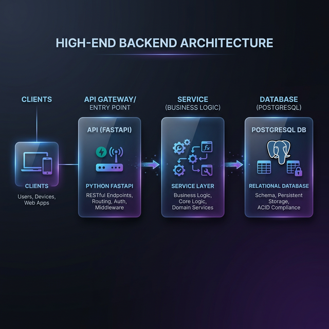

# NexTrack 📊


Production-style REST API built with **FastAPI**, featuring JWT authentication, RBAC, monitoring, and structured error handling.

---

## 🚀 Tech Stack

| Layer | Technology |
|---|---|
| Web Framework | FastAPI |
| Database | PostgreSQL (prod) / SQLite (dev) |
| ORM | SQLAlchemy (async) |
| Migrations | Alembic |
| Auth | JWT (python-jose + passlib) |
| Validation | Pydantic v2 |
| Testing | pytest + pytest-asyncio |

---

## ✨ Features

- **User Authentication** — Register, login, JWT-protected endpoints
- **Transaction Management** — Create, read, update, delete transactions (CRUD)
- **Multiple Payment Methods** — UPI, Card, Cash, Bank Transfer
- **Statistics & Analytics** — Category breakdowns, totals, spending summaries
- **Pagination & Filtering** — Page-based results, filter by category/status
- **Advanced Search** — Full-text search and date-range filters
- **Bulk Operations** — Create/delete multiple transactions at once
- **Export** — Download transactions as CSV
- **Health Check** — `/health` endpoint with DB connectivity status
- **Auto Docs** — Swagger UI at `/docs`, ReDoc at `/redoc`

---

## 🔐 Production Enhancements (v2.1.0)

- **Role-Based Access Control** — Admin/User roles with `require_admin` middleware
- **Structured JSON Error Responses** — All errors return `{ "success": false, "message": "..." }`
- **Environment-Based Configuration** — `SECRET_KEY` loaded from environment variables
- **Request Tracing** — UUID-based `X-Request-ID` header on every response
- **API Performance Metrics** — Live dashboard at `/admin/metrics` (admin only)
- **Alembic Migration Versioning** — Schema changes tracked via numbered migrations

---

## 🏗️ Project Structure

```
NexTrack/
├── src/
│   ├── api/
│   │   ├── main.py              # FastAPI app, all routes
│   │   ├── schemas.py           # Request/response Pydantic models
│   │   ├── auth_routes.py       # Registration & login endpoints
│   │   ├── auth_schemas.py      # Auth Pydantic models
│   │   └── advanced_routes.py   # Search, export, bulk endpoints
│   ├── application/
│   │   └── services.py          # Business logic (TransactionService)
│   ├── infrastructure/
│   │   ├── database/
│   │   │   ├── config.py        # DB engine & session setup
│   │   │   ├── models.py        # SQLAlchemy ORM models
│   │   │   └── user_model.py    # User ORM model
│   │   ├── auth.py              # JWT token utilities
│   │   └── monitoring.py        # Request logging middleware
│   └── domain_models.py         # Core domain entities & payment types
├── tests/
│   ├── test_api.py              # API integration tests
│   └── test_domain_models.py    # Domain model unit tests
├── alembic/                     # Database migration scripts
├── .env.example                 # Environment variable template
├── docker-compose.yml           # Docker deployment config
├── Dockerfile                   # Container image definition
├── requirements.txt             # Python dependencies
└── alembic.ini                  # Alembic configuration
```

---

## ⚡ Quick Start

### Prerequisites
- Python 3.10+
- Git

### 1. Clone & Set Up

```bash
git clone https://github.com/manikanta-dev-fs/NexTrack.git
cd NexTrack

# Create virtual environment
python -m venv .venv

# Activate it
# Windows:
.venv\Scripts\activate
# macOS/Linux:
source .venv/bin/activate

# Install dependencies
pip install -r requirements.txt
```

### 2. Configure Environment

```bash
# Copy the example env file and edit it
copy .env.example .env
# (On macOS/Linux: cp .env.example .env)
```

Edit `.env` with your values (the defaults work fine for local development).

### 3. Run Database Migrations

```bash
python -m alembic upgrade head
```

### 4. Start the Server

```bash
python -m uvicorn src.api.main:app --reload
```

Open **http://localhost:8000/docs** to explore and test the API interactively.

---

## 📡 API Endpoints

### Authentication
| Method | Endpoint | Description |
|--------|----------|-------------|
| POST | `/auth/register` | Create a new account |
| POST | `/auth/login` | Get JWT access token |
| GET | `/auth/me` | Get current user info |

### Transactions (🔒 requires auth)
| Method | Endpoint | Description |
|--------|----------|-------------|
| POST | `/api/v1/transactions` | Create a transaction |
| GET | `/api/v1/transactions` | List transactions (paginated) |
| GET | `/api/v1/transactions/{id}` | Get a single transaction |
| PATCH | `/api/v1/transactions/{id}` | Update a transaction |
| DELETE | `/api/v1/transactions/{id}` | Delete a transaction |

### Statistics & Advanced (🔒 requires auth)
| Method | Endpoint | Description |
|--------|----------|-------------|
| GET | `/api/v1/statistics` | Spending summary & analytics |
| GET | `/api/v1/search` | Search transactions |
| GET | `/api/v1/export/csv` | Export transactions as CSV |
| POST | `/api/v1/bulk` | Bulk create transactions |

### Admin (🔒 Admin Only)
| Method | Endpoint | Description |
|--------|----------|-------------|
| GET | `/admin/users` | List all registered users |
| GET | `/admin/metrics` | API performance metrics dashboard |

### System
| Method | Endpoint | Description |
|--------|----------|-------------|
| GET | `/health` | Health check |
| GET | `/docs` | Swagger UI |
| GET | `/redoc` | ReDoc docs |

---

## 🧪 Running Tests

```bash
python -m pytest tests/ -v
```

To run with coverage:
```bash
python -m pytest tests/ --cov=src --cov-report=term-missing
```

---

## 🏗️ Architecture Diagram



---

## 🏛️ Architecture

The project follows a **layered architecture** pattern:

```
HTTP Request
    ↓
API Layer (FastAPI routes + Pydantic validation)
    ↓
Application Layer (TransactionService — business logic)
    ↓
Infrastructure Layer (SQLAlchemy ORM + PostgreSQL / SQLite)
```

Key design patterns used:
- **Repository Pattern** — data access through the service layer
- **Strategy Pattern** — pluggable payment method handling
- **Factory Pattern** — payment object creation from request data
- **Dependency Injection** — FastAPI's `Depends()` for DB sessions & auth

---

## 🐳 Docker (PostgreSQL)

```bash
# Start PostgreSQL + API
docker-compose up -d

# View logs
docker-compose logs -f api

# Stop services
docker-compose down
```

The app will be available at **http://localhost:8000** with PostgreSQL.

---

## 🗺️ What I Learned

- Designing a multi-layer REST API with FastAPI
- Async database access with SQLAlchemy + aiosqlite
- JWT-based authentication flow (register → login → protected routes)
- Database schema versioning with Alembic migrations
- Writing async integration tests with pytest-asyncio
- Clean architecture: separating domain logic from infrastructure

---

## 🌍 Live Demo

- **Base URL:** Coming Soon
- **Swagger Docs:** `/docs`
